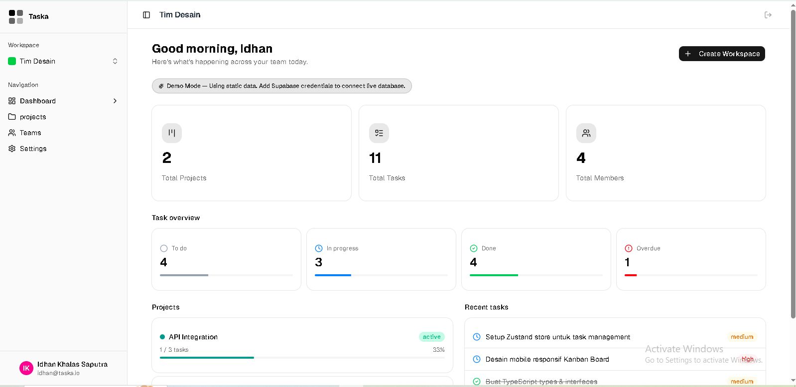
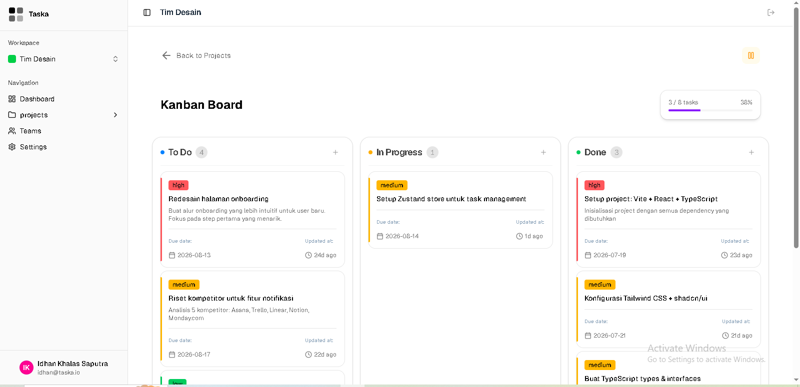
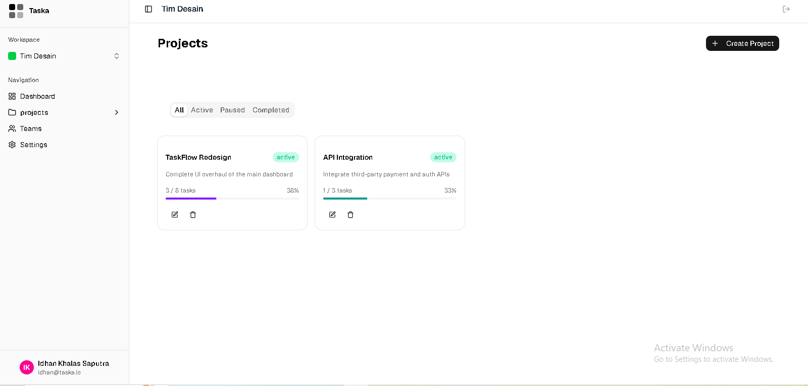

# Taska — Multi-Workspace Task Management App

Taska is a workspace-based task management app (similar to Linear/Notion) built to support team collaboration through workspaces, projects, and tasks with role-based access. Built with React 19, TypeScript, and Supabase.

---

## 📸 Screenshots

| Dashboard View                                | Kanban View                             | project view                              |
| --------------------------------------------- | --------------------------------------- | ----------------------------------------- |
|  |  |  |

---

## ✨ Features

- **Multi-workspace** — one account can own or join multiple workspaces, each with separate projects and teams
- **Project management** — create, edit, delete (owner only), and pause/resume project status (active / paused / completed)
- **Kanban board** — drag-and-drop tasks between status columns (todo / in-progress / done) using `dnd-kit`
- **Task management** — full task CRUD with priority (low/medium/high), due dates, and filters (search, priority, due date range). Any workspace member can delete tasks; deleting a project or workspace is restricted to the owner, since those actions cascade and remove everything inside them
- **Team collaboration** — invite members via invite link, manage roles (owner/member), and remove members from a workspace
- **Dashboard & stats** — summary of project count, task count, member count, overdue tasks, and tasks completed this week
- **Authentication** — sign up, sign in, forgot password, and reset password (OTP flow) via Supabase Auth
- **Account & workspace settings** — change display name, change password, rename workspace, delete workspace with type-to-confirm
- **Demo (mock) mode** — the app remains fully explorable without a real Supabase connection, with automatic fallback when offline

---

## 🛠️ Tech Stack

| Category         | Technology                                      |
| ---------------- | ----------------------------------------------- |
| Framework        | React 19 + TypeScript + Vite                    |
| Styling          | Tailwind CSS + shadcn/ui                        |
| State management | Zustand                                         |
| Backend          | Supabase (PostgreSQL, Auth, Row Level Security) |
| Routing          | React Router v6                                 |
| Drag & drop      | dnd-kit                                         |
| Animation        | Motion (Framer Motion)                          |
| Notifications    | Sonner                                          |

---

## 🏗️ Architecture

**Data model:** `User → Workspace → Project → Task`, with a `workspace_members` join table for the many-to-many relationship between users and workspaces, including each member's role.

**Dual mode:** Taska can run in two modes:

- **Live mode** — connects to a real Supabase project when `VITE_SUPABASE_URL` and `VITE_SUPABASE_ANON_KEY` are set and the browser is online.
- **Mock/demo mode** — uses local static data, activated automatically when credentials are missing, the browser is offline, or forced manually via a UI toggle.

State is managed with Zustand, split per domain (`authStore`, `workspaceStore`, `projectStore`, `taskStore`) so each state slice stays isolated and easy to reason about.

**Row Level Security:** All authorization is enforced at the database level via Postgres RLS policies, not just in the UI. Two `security definer` helper functions (`is_workspace_member`, `is_workspace_owner`) are used inside policies to avoid recursive RLS checks when a policy needs to query another RLS-protected table. Every `delete()` call in the client also verifies the returned row count — a delete blocked by RLS returns no error in Supabase, so checking `data.length` after `.select()` is what actually confirms whether the operation succeeded.

---

## 🗄️ Database Schema

The full database schema — tables, RLS policies, `security definer` functions, and triggers — is documented in [`supabase/schema.sql`](./supabase/schema.sql). This file can be run top-to-bottom against a fresh Supabase project to fully reproduce the database structure (the order matters: tables → functions → triggers → RLS).

---

## 📁 Project Structure

```
src/
├── auth/          # Sign in, sign up, forgot/reset password pages
├── components/
│   ├── dashboard/ # Stat cards & summary widgets
│   ├── kanban/    # Board & drag-and-drop task cards
│   ├── layout/    # Sidebar, header, main layout
│   ├── project/   # Project CRUD & filters
│   ├── settings/  # Account & workspace settings
│   ├── team/      # Invite & manage team members
│   └── ui/        # shadcn/ui components
├── data/          # Static data used in mock mode
├── hooks/         # Custom hooks
├── lib/           # Supabase config & utilities
├── pages/         # Top-level route pages
├── store/         # Zustand stores per domain
└── types/         # TypeScript types & Supabase-generated types

supabase/
└── schema.sql     # Full database schema (tables, RLS, functions, triggers)
```

---

## 🚀 Running Locally

### 1. Clone & install dependencies

```bash
git clone https://github.com/idhan724/taska---Dashboard-Task-Management.git
cd taska
npm install
```

### 2. (Optional) Configure Supabase

Create a `.env` file in the project root to run the app in **live mode**:

```env
VITE_SUPABASE_URL=your-supabase-project-url
VITE_SUPABASE_ANON_KEY=your-supabase-anon-key
```

To set up the database itself, run [`supabase/schema.sql`](./supabase/schema.sql) in the SQL Editor of a new Supabase project.

> Without a `.env` file, the app automatically runs in **mock mode** using static data — great for just exploring the UI.

### 3. Start the dev server

```bash
npm run dev
```

### Other scripts

```bash
npm run build     # production build
npm run lint      # run ESLint
npm run preview   # preview the production build
```

---
